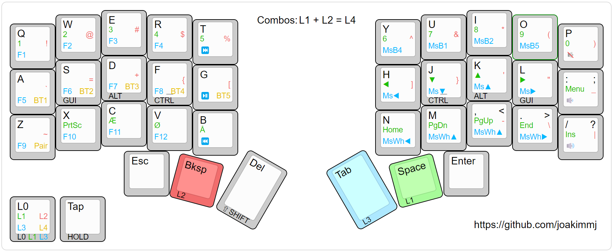

# ZMK configuration

## Corne

> Image is generated using www.keyboard-layout-editor.com ([raw data](./assets/3x5-home-row-mods-v4.kle.json))

This keymap is using home row mods. Mouse bindings is currently not working (waiting for https://github.com/zmkfirmware/zmk/pull/2027).

